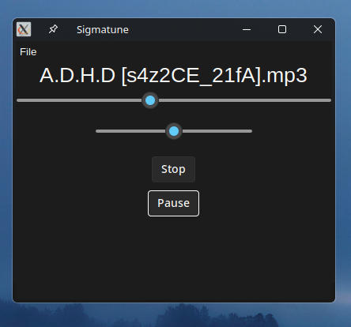

# Sigmatune
A python music player with bugs.

## Known Bugs
- The progress bar (first scale widget) only works in seeking the current   music, it does not switch or move after a new song.
# Run (GNU/Linux)
1. Download the .py
2. In a terminal,
`python3 main.py`
